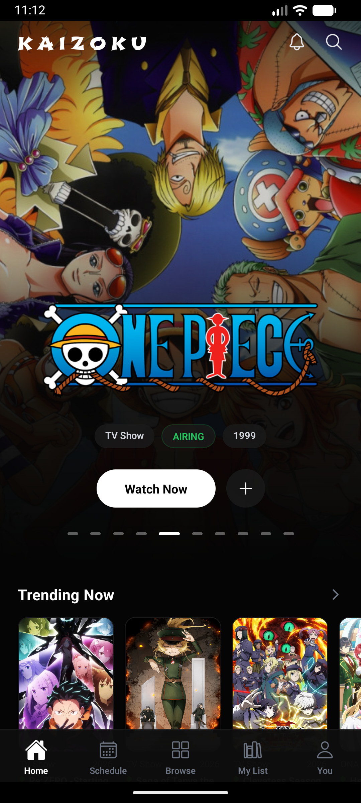
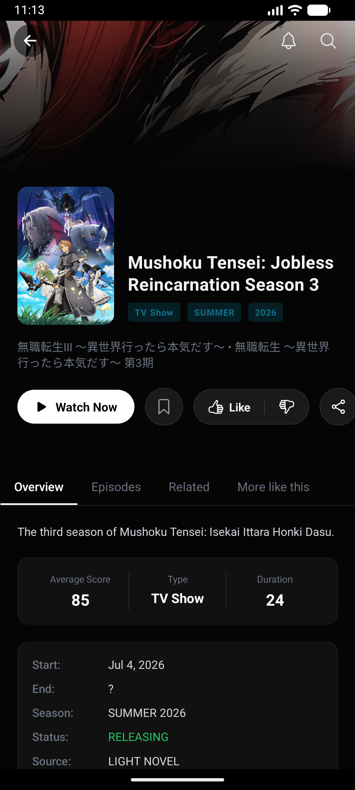
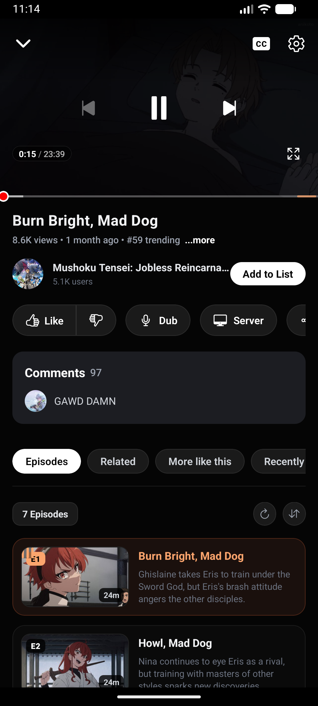
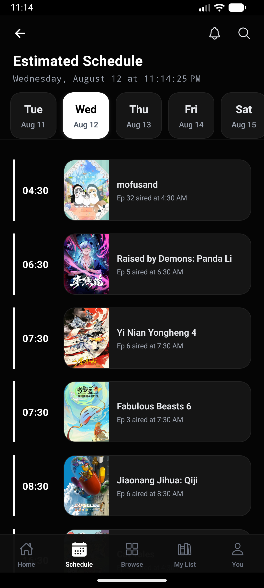

<h1 align="center"><b>Kaizoku App</b></h1>

<p align="center">
  
</p>

<p align="center">
  <a href="https://github.com/Yaboku77/kaizoku/releases/latest">
    
  </a>
</p>

Kaizoku is a premium anime streaming mobile app built with React Native and Expo. It combines browsing, search, detailed anime information, a high-quality video player, and watchlist tracking in a polished UI.

## What is this project?

This repository is a React Native (Expo) application for a premium anime streaming experience. It includes:

- A home screen with trending and featured anime carousels
- Anime discovery, advanced search, and detailed information screens
- A powerful built-in video player with Picture-in-Picture (PiP) support
- Progress tracking and custom watchlists synchronized across devices
- A daily airing schedule for currently releasing anime

## Core functionality

The app delivers several main functions:

- **Browse anime** through category, trending, and search interfaces
- **View detailed media pages** with episode access and character information
- **Watch anime** using a high-quality player with PiP, background audio, and skip intro/outro controls
- **Track user progress** via cloud sync and watch history
- **Manage a custom watchlist** (Planning, Watching, Completed, etc.)
- **Follow daily schedules** for new episodes

<h2 align="center">📱 App Preview</h2>

<p align="center">
  
  
  
</p>
<p align="center">
  
</p>

## How it works

### Frontend

- Uses React Native and Expo for a truly native mobile experience
- Navigation is handled by React Navigation (Bottom Tabs & Native Stack)
- Client-side features are built in React with custom components
- Data fetching leverages direct GraphQL and REST API calls

### Data sources

- Anime data and schedules are fetched from AniList via GraphQL
- Additional metadata and images are pulled from TMDB (REST API)
- Video streams are dynamically scraped from top-tier servers (VidPlay, HD-1, VidCloud) in real-time
- User data, watch progress, and watchlists are synced using Firebase (Firestore & Authentication)

### Tracking and user features

- Users can manage their watch history and organize anime into various lists (Watching, Completed, Dropped, etc.)
- The app tracks viewing progress accurately, allowing users to resume episodes right where they left off
- Cloud sync ensures your data is available seamlessly across your devices

## Project structure

- `package.json` — project dependencies and scripts
- `App.js` — root entry point and navigation setup
- `src/screens` — main application screens (Home, Player, Browse, Details, etc.)
- `src/components` — reusable UI components
- `src/api` — API helper utilities and scrapers (AniList, TMDB, extractors)
- `src/context` — global state and authentication providers
- `src/data` — constants and local mock data

## Technologies used

- React Native & Expo
- React Navigation
- `expo-av` and `react-native-webview` for video playback
- AniList (GraphQL) & TMDB (REST API)
- Firebase (Firestore & Authentication)
- React Native Reanimated & LayoutAnimation for 60fps gestures
- Vanilla StyleSheet, `expo-linear-gradient`, and `expo-blur`

## Usage

### Install dependencies

```bash
npm install
```

### Run development server

```bash
npx expo start
```

### Build APK (Android)

```bash
# Install EAS CLI
npm install -g eas-cli

# Build locally with Android Studio
npx expo run:android

# OR build in the cloud
eas build --platform android --profile preview
```

## Main routes / Screens

- `Splash` — Animated intro and loading
- `Home` — Landing screen with featured content
- `Browse` — Search and advanced filtering
- `Details` — Comprehensive anime information
- `Player` — Advanced video player and episode list
- `Schedule` — Daily airing schedule
- `MyList` — User watchlists
- `You` — User profile and settings

## Notes

- The app uses custom web scrapers to dynamically fetch streaming links.
- Firebase must be configured for cloud sync features to work correctly.
- Ensure you have the TMDB API key set in `src/data/constants.js`.

---

Built for a fast, polished anime streaming experience powered by React Native and Expo.
